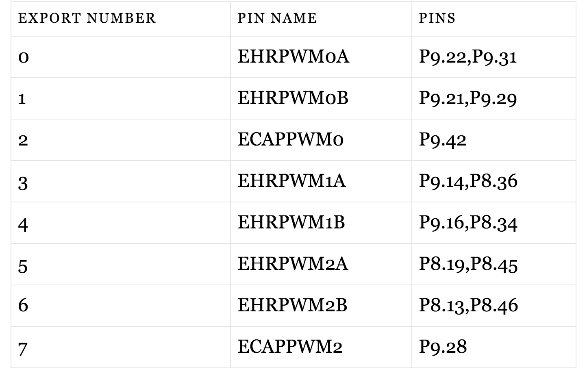

# CVRA cape

A Beaglebone black extension board for robots used at [CVRA](http://www.cvra.ch/).

## Features
- 2x CAN interfaces with transceivers
- 8x PWM outputs to control servo motors and pneumatic pumps.

## Notes

### PWM
The PWM outputs are numbered according to the following table

### CAN
There are 2 CAN interfaces on the cape.
- `CAN0` uses the `DCAN0` interface on the Beaglebone so it's wired on the `I2C` that handles capes
    * `CAN0_RX` is on pin `P9.19`
    * `CAN0_TX` is on pin `P9.20`

- `CAN1` uses the `DCAN1` interface on the Beaglebone
    * `CAN1_RX` is on pin `P9.24`
    * `CAN1_TX` is on pin `P9.26`
